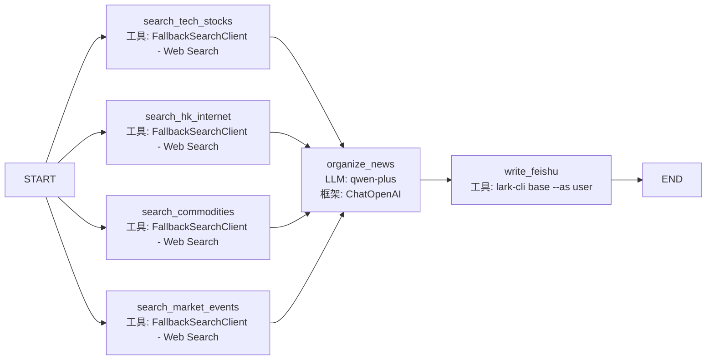

# 项目结构说明

## 飞书 Skill 安装提醒

首次在新环境运行前，请先安装并登录飞书 CLI 与 Skill。项目入口现在会在真正开始搜索和 LLM 整理前，强制执行一轮 CLI 预检；只要脚手架、user 登录态或 Base 读权限不通过，就会直接失败，不再继续跑后续步骤。

```bash
npm install -g @larksuite/cli
npx -y skills add https://open.feishu.cn --skill -y
lark-cli config init --new
lark-cli auth login --scope "bitable:app:readonly bitable:app"
lark-cli auth status
```

建议再补一条只读权限检查，确认目标 Base/Table 在当前 user 身份下可见：

```bash
lark-cli base +field-list --as user --base-token "$FEISHU_BASE_TOKEN" --table-id "$FEISHU_TABLE_ID"
```

若未完成以上步骤，项目入口会直接终止，不会继续搜索、调用 LLM 或尝试写入飞书。

## .env 配置模板（不含真实值）

请在项目根目录创建或更新 .env，按下面模板填写。示例只展示键名与说明，不包含任何真实密钥。

```dotenv
# 搜索与模型服务
SERPER_API_KEY=            # Google Serper 搜索 API Key
OPENAI_API_KEY=            # OpenAI / 兼容模型服务 API Key
OPENAI_BASE_URL=           # OpenAI 兼容服务地址（如网关地址）

# 飞书应用配置
FEISHU_APP_ID=             # 飞书应用 App ID（cli_xxx）
FEISHU_APP_SECRET=         # 飞书应用 App Secret
FEISHU_BASE_TOKEN=         # 用于 lark-cli base +... / base/v3/bases/:base_token 的 base_token
FEISHU_TABLE_ID=           # 目标数据表 table_id（tbl_xxx）

# 项目运行环境
COZE_WORKSPACE_PATH=       # 本地工作区路径
COZE_PROJECT_ENV=          # 环境标识（如 dev/test/prod）
```

补充说明：

- 当前项目与飞书 Base 的交互只走 `lark-cli base +...`，运行时只需要 `FEISHU_BASE_TOKEN` 和 `FEISHU_TABLE_ID`。
- 旧的 Python OpenAPI 写入支路已经移除，README 中不再把 `app_token` 作为工作流输入前提。

### 为什么会出现 `param baseToken is invalid`

这类报错多数不是权限问题，而是把旧接口里的 `app_token` 误传给了要求 `base_token` 的 CLI / Base v3 接口。

- 飞书官方在多维表格 `bitable/v1` 文档中，将路径参数定义为 `app_token`，例如 `GET /open-apis/bitable/v1/apps/:app_token`。
- 飞书 CLI 的 `lark-cli base +...` 命令走的是另一套接口，即 `base/v3`，例如 `GET /open-apis/base/v3/bases/:base_token`。
- 飞书官方产品名现在叫 Base，但旧接口与旧文档里仍大量保留 Bitable 命名；两套接口并存时，最容易踩坑的地方就是把 `app_token` 和 `base_token` 当成同一个值。
- 对于 `base_token` 需要通过 `https://open.feishu.cn/open-apis/wiki/v2/spaces/get_node` 获取，其中的 `obj_token` 就是 `base_token`。


- 看到 `base/v3/bases/...`，使用 `FEISHU_BASE_TOKEN`。
- 看到 `lark-cli base +...`，默认按 `base/v3` 理解，优先传 `FEISHU_BASE_TOKEN`。

如果你已经确认用户身份授权正常，但 `lark-cli base +field-list`、`+record-list`、`+base-get` 仍报 `param baseToken is invalid`，优先排查是否传错了 token 类型，而不是先怀疑 scope。

## 工作流梳理（含 LLM/工具）

本项目使用 LangGraph 编排，整体为 4 路并行搜索 → LLM 整理 → 飞书写入。

> **Web Search 供应商优先级（FallbackSearchClient）**  
> `Serper（Google Serper API）` → `Bing（Azure Bing News v7）` → `Brave Search API` → `Google CSE`  
> 遇到配额耗尽（429/403）时自动冷却 24h 并切换至下一供应商。只有对应环境变量已配置的供应商会被启用。



### 节点与技术栈对应

| 节点 | 作用 | 使用的 LLM/工具 |
|---|---|---|
| search_tech_stocks | 抓取科技股资讯 | FallbackSearchClient（Web Search） |
| search_hk_internet | 抓取港股基金021378持仓相关资讯 | FallbackSearchClient（Web Search） |
| search_commodities | 抓取大宗商品资讯 | FallbackSearchClient（Web Search） |
| search_market_events | 抓取市场震荡事件资讯 | FallbackSearchClient（Web Search） |
| organize_news | 分类、去重、结构化摘要、真实性与预测评估 | LLM: qwen-plus（配置文件: config/organize_news_llm_cfg.json）+ ChatOpenAI |
| write_feishu | 字段对齐、按链接去重、批量写入多维表格 | lark-cli base（`--as user`） |

# 本地运行
## 运行流程
bash scripts/local_run.sh -m flow

Windows 一键运行：

```powershell
.\scripts\run_flow.ps1
```

说明：该入口现在会在真正执行工作流前，先校验 `lark-cli` 可用性、`lark-cli auth status` 的 user 登录态，以及目标 Base 的 `+field-list` 只读权限。任一失败都会直接报错退出。

## 运行节点
bash scripts/local_run.sh -m node -n node_name

Windows 单节点运行：

```powershell
.\scripts\run_flow.ps1 -Mode node -Node write_feishu
```

# 启动HTTP服务
bash scripts/http_run.sh -m http -p 5000

Windows 启动 HTTP 服务：

```powershell
.\scripts\run_flow.ps1 -Mode http -Port 5000
```

## 飞书 CLI 鉴权排查

当前项目运行前，先确认本机 `lark-cli` 已登录且默认身份可用：

```bash
lark-cli auth status
```

若未登录或身份失效，重新登录：

```bash
lark-cli auth login --scope "bitable:app:readonly bitable:app"
```

登录后可先做只读检查，确认 `base_token` 与 `table_id` 可用：

```bash
lark-cli base +field-list --as user --base-token "$FEISHU_BASE_TOKEN" --table-id "$FEISHU_TABLE_ID"
```

若该命令可正常返回字段列表，说明当前 CLI 身份与目标 Base 已可用于工作流写入。当前项目的 `flow`、`stream_run` 和 `node(write_feishu)` 入口都会在开始前强制执行这一步校验；失败时直接中止，避免先做搜索和整理，最后才发现飞书不可用。

